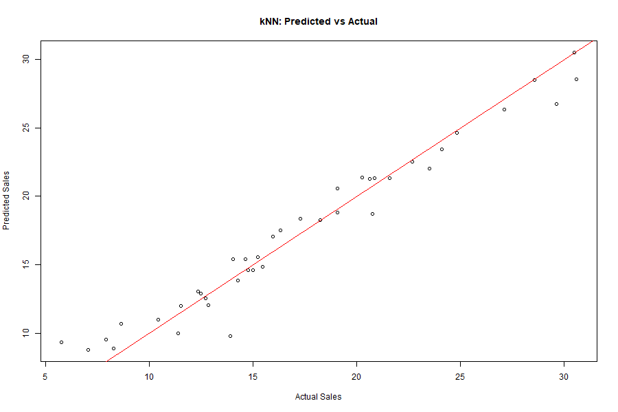

# Advertising Sales Prediction (kNN vs Linear Regression) — R

## Overview
This project predicts product sales using advertising budgets across three media channels:
YouTube, Facebook, and Newspaper.

We compare:
- k-Nearest Neighbors (kNN) regression
- Linear Regression
- Polynomial + interaction-enhanced Linear Regression

## Dataset
The dataset used is the `marketing` dataset from the `datarium` R package.
It contains 200 advertising experiments with:

- youtube (advertising budget in $1000s)
- facebook (advertising budget in $1000s)
- newspaper (advertising budget in $1000s)
- sales (units sold)

## Methodology

1. Exploratory Data Analysis (EDA)
   - Summary statistics
   - Histograms
   - Correlation matrix
   - Scatterplot matrix

2. Train/Test Split
   - 80% training data
   - 20% test data

3. Models Implemented
   - kNN regression with cross-validation
   - Linear regression
   - Polynomial regression
   - Interaction term regression

4. Model Evaluation
   - Root Mean Squared Error (RMSE)

## Results (Test RMSE)

- kNN: ~1.37  
- Linear Regression (Baseline): ~1.95  
- Linear Regression (Enhanced): ~0.51 

The interaction-enhanced regression model significantly reduced test RMSE, outperforming both kNN and the baseline linear regression.

## Key Insights

- YouTube and Facebook spending strongly influence sales.
- Newspaper spending shows significantly lower correlation with sales compared to YouTube and Facebook.
- Residual diagnostics revealed nonlinear (quadratic) patterns.
- Feature engineering (interaction terms) drastically improved performance.
- A well-specified parametric model outperformed kNN.

## How to Run

Install required packages:

```r
install.packages(c("datarium", "ggplot2", "psych", "corrplot", "caret"))
```

Then run:

```
analysis.R
```

## Technologies Used

- R
- caret
- ggplot2
- corrplot
- psych

## Visual Results

### kNN Tuning (RMSE vs k)


### kNN: Predicted vs Actual


### Enhanced Linear Regression: Predicted vs Actual


### Enhanced Model Residual Diagnostics


## Mathematical Notes

For deeper understanding and derivation of the correlation coefficient and R-squared,
see:

- [Pearson Correlation Derivation](notes/Pearson_Correlation_Coefficient_and_R_squared_Derivation.pdf)